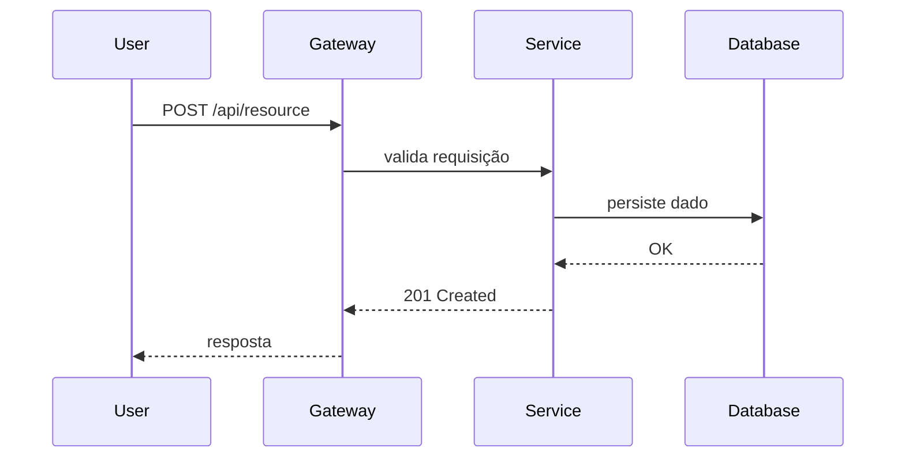
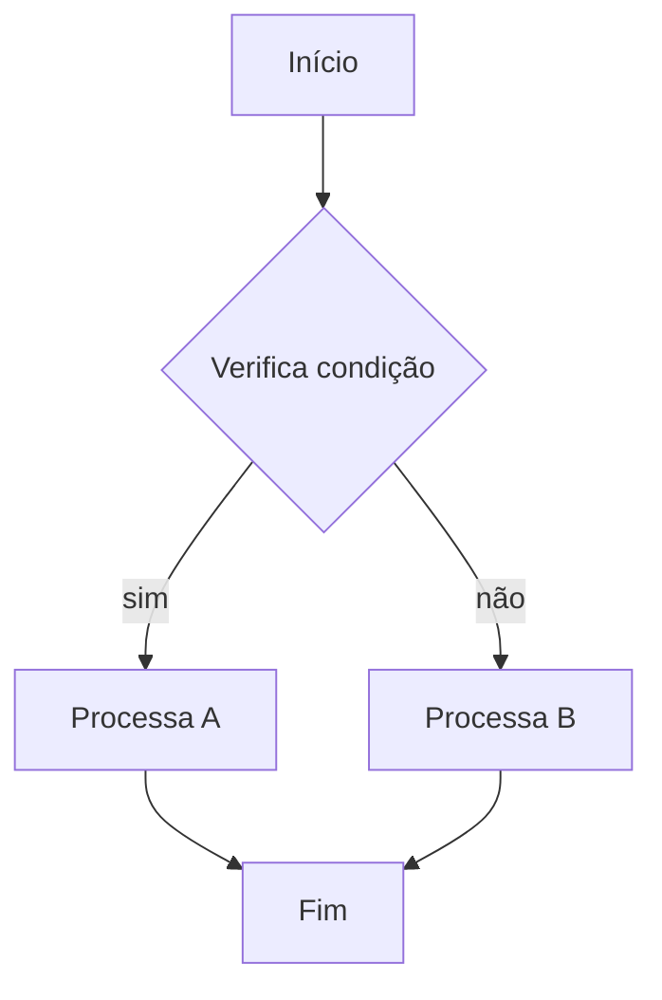
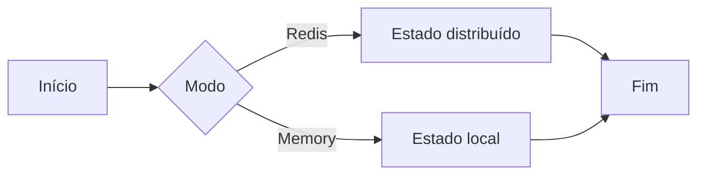
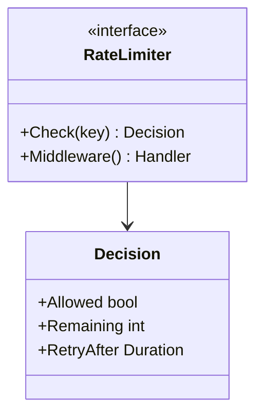
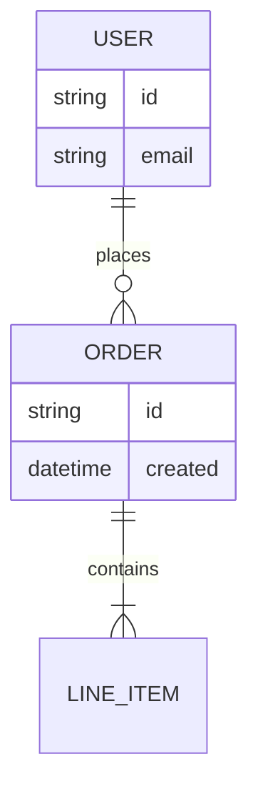

# Sintaxe Mermaid: guardrails e templates seguros

Leia antes de escrever qualquer código de diagrama. As regras abaixo existem porque cada uma
delas já quebrou a renderização de um diagrama real.

## Guardrails

### Identificadores e rótulos são coisas diferentes

O **identificador** do nó é ASCII puro. O **rótulo** aceita acentos normalmente.

```
%% errado
flowchart TD
    Operação[Operação] --> Não[Não]

%% certo
flowchart TD
    Operacao[Operação] --> Nao[Não]
```

Vale para nós, estados e subgraphs.

### Quebra de linha dentro do rótulo

Use `<br/>`, nunca `\n`.

```
%% errado
A[Primeira linha\nSegunda linha]

%% certo
A[Primeira linha<br/>Segunda linha]
```

### Um rótulo, um bloco

```
%% errado
A[Primeira parte][Segunda parte]

%% certo
A[Primeira parte<br/>Segunda parte]
```

### Títulos de subgraph e nomes de participante com espaço ou acento vão entre aspas

```
%% errado
subgraph Modo Redis (estado compartilhado)
participant R as Redis (Lua)

%% certo
subgraph "Modo Redis (estado compartilhado)"
participant R as "Redis (Lua)"
```

### Setas não se misturam entre tipos de diagrama

- `sequenceDiagram`: `->>`, `-->>`, `--x`
- `flowchart`: `-->`, `-.->`, `-- texto -->`

### Sem `;` nem `:` dentro de identificadores

Dois-pontos só em texto de aresta: `A -->|não| B`.

### Sem expressão de código dentro de rótulo

É a causa mais frequente de erro de parse. Rótulo é texto descritivo; detalhe técnico vai
para a seção de notas abaixo do diagrama.

| Não use | Use |
| --- | --- |
| `[count++]` | `[Incrementa contador]` |
| `[tokens = min(burst, tokens + rate)]` | `[Recalcula tokens]` |
| `{counter{key}++}` | `{Incrementa métrica}` |
| `[remaining = limit - count]` | `[Atualiza saldo]` |

Evite em rótulos: chamadas de função (`min(`, `max(`, `sum(`, `count(`), incremento e
decremento (`++`, `--`), operadores compostos (`+=`, `-=`, `*=`, `/=`) e sintaxe de métrica
com chaves.

### Sem markdown aninhado no rótulo

Texto puro. Nada de crase, negrito ou link dentro do rótulo.

### Todo bloco fecha

Toda abertura ```mermaid tem o fechamento ``` em linha própria.

## Validação antes de escrever o arquivo

1. Extraia o conteúdo de todos os rótulos de todos os diagramas.
2. Procure os padrões proibidos acima.
3. Reescreva o rótulo problemático para texto simples e descritivo.
4. Mova o detalhe técnico para as notas abaixo do diagrama.
5. Revalide até não sobrar nenhum.

## Nomenclatura

| Categoria | Nomes |
| --- | --- |
| Sistemas externos | External, Gateway, Client, User |
| Componentes internos | Service, Worker, Handler, Manager, Controller |
| Armazenamento | Store, Cache, Database, Queue, Repository |
| Infraestrutura | Collector, Logger, Tracer, Monitor |

Abreviações aceitas em texto de aresta: OK, NO, YES, ERR, RETRY, TIMEOUT, CFG, AUTH.

Rótulo de nó: no máximo 3 palavras.

## Templates seguros

### Sequência



### Flowchart TD, para algoritmo e máquina de estados



### Flowchart LR, para comparar modos



### Class, para contratos públicos



### ER, para relações entre entidades



## Layout

- `TD` para fluxo e algoritmo.
- `LR` para comparação entre alternativas.
- Diagrama de classes mostra só os tipos essenciais e as relações entre eles.
